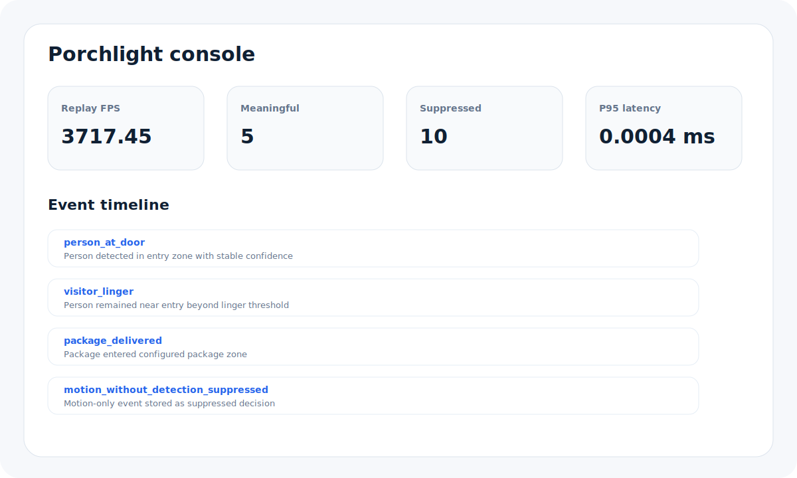
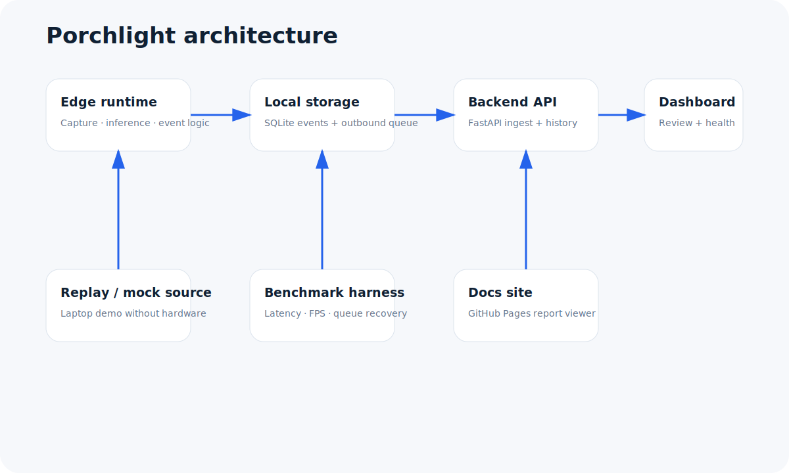
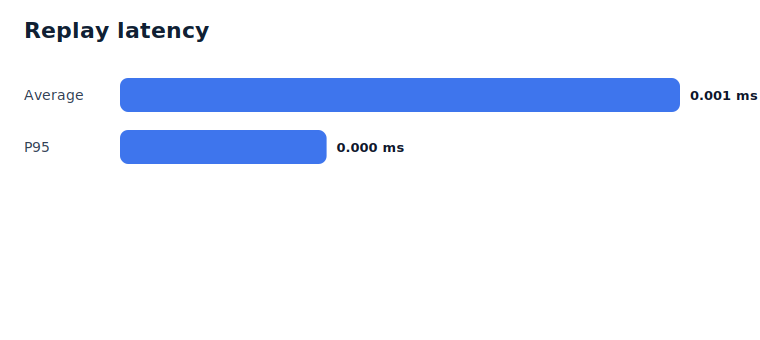
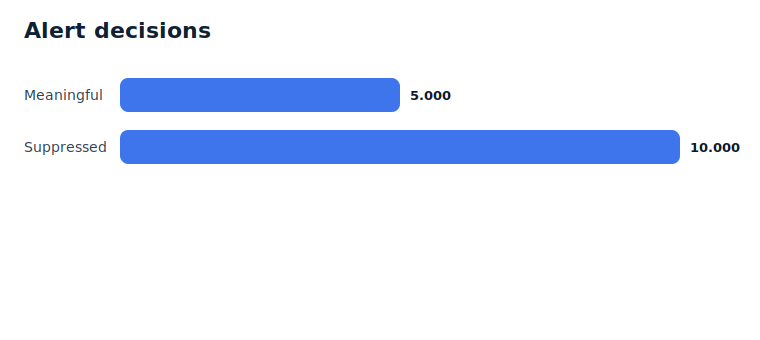

# Porchlight

**Edge AI Smart Doorbell and Intelligent Event Detection Platform**
https://avi-patel-1.github.io/DoorbellAIPlatform/
Porchlight is a software-first connected-device project for a Linux smart doorbell or entry-monitoring device. The edge runtime decides which porch activity matters before anything is sent upstream: it filters low-confidence motion, suppresses duplicate alerts, keeps operating during network outages, and sends explainable events plus device health telemetry to a backend and dashboard.

The project is designed to be easy to review on a laptop and still map cleanly to a Raspberry Pi or other Linux edge device. The default demo does not require a camera, GPU, model download, cloud account, or special hardware.



## Reviewer quick scan

Porchlight is meant to communicate practical engineering depth for connected-home, IoT, embedded Linux, device software, edge AI, and platform tooling roles.

| Area | What to inspect |
|---|---|
| Linux / C++ device software | `edge-runtime/` C++17 daemon, CMake build, replay/live/mock source abstraction, SQLite persistence |
| Edge AI / event intelligence | `edge-runtime/src/logic/` temporal smoothing, confidence gates, package-zone logic, linger detection, dedupe/cooldown logic |
| Device agent reliability | local event store, outbound queue, retry behavior, health metrics, simulated offline/reconnect flow |
| Backend and API | `backend/` FastAPI service with event ingest, device registry, metrics, exports, WebSocket updates, tests |
| Dashboard / product tooling | `dashboard/` React + TypeScript operations console for devices, events, settings, and benchmarks |
| Demo and benchmarks | `demo-assets/`, `simulator/`, and `benchmarks/` produce repeatable results from bundled scenarios |
| Documentation polish | `docs-site/` product-style GitHub Pages site with diagrams, charts, setup notes, and architecture pages |

A fast local review path is:

```bash
make edge
make benchmark
```

A full local product demo is:

```bash
make demo
```

## What this project is

Porchlight is a connected-device software stack. It focuses on the code that sits between a camera sensor and a user-facing alert stream:

1. read frames or replay records from an edge source;
2. decide whether motion deserves inference or suppression;
3. convert raw detections into higher-level events;
4. explain every surfaced alert and every suppressed decision;
5. store events locally so the device survives backend downtime;
6. publish event history and telemetry to an API when connectivity returns;
7. present the system through a dashboard, benchmark report, and docs site.

It is not a hardware PCB project, a consumer mobile app, or a claim of production deployment. The live-camera and full-model paths are supported through clear interfaces, while the default replay mode keeps the repository dependable for review, CI, and demos.

## Problem statement

Entry cameras create noisy data. Passing headlights, wind, sidewalk traffic, repeated visitors, animals, shadows, and package handoffs can all look like motion. A useful doorbell should not upload every frame or page a user for every motion spike.

Porchlight treats alert quality as an edge software problem. It moves decision-making close to the device, keeps a durable local record, and exposes enough telemetry for debugging field behavior.

## Key features

- **C++17 Linux edge runtime:** modular capture sources, replay/mock/live modes, motion gate, inference interface, event aggregation, local SQLite storage, HTTP publishing, health collection, and safe shutdown.
- **AI/ML-ready inference boundary:** the default demo uses bundled replay detections, and the `InferenceEngine` interface is ready for an ONNX Runtime or other CPU-friendly detector.
- **Explainable event decisions:** person-at-door, visitor-linger, package-delivered, package-removed, repeated-motion, low-confidence suppression, and duplicate suppression records all include structured reasons.
- **Nuisance-alert reduction:** temporal smoothing, confidence thresholds, package-zone checks, quiet-hours hooks, home/away mode hooks, dedupe windows, and cooldown windows prevent alert spam.
- **Offline-first behavior:** the edge device writes events and outbound messages locally, simulates network loss, and flushes the queue when connectivity recovers.
- **Cloud-style backend:** FastAPI service for device registration, token-authenticated ingest, health metrics, event filtering/search, exports, OpenAPI docs, benchmark storage, and live updates.
- **Operations dashboard:** React + TypeScript console for overview metrics, event review, event detail, device health, settings, benchmarks, and demo replay.
- **Reproducible benchmark harness:** scripts run the bundled replay scenario, generate JSON/Markdown/SVG reports, and avoid unsupported hardware-performance claims.
- **GitHub Pages docs site:** static product/engineering site with architecture diagrams, benchmark charts, setup notes, API summary, troubleshooting, and FAQ.

## Architecture overview



```text
camera / replay CSV / synthetic source
  -> motion gate
  -> inference backend
  -> temporal event aggregation
  -> suppression, package-zone, linger, and cooldown policy
  -> SQLite event store + outbound queue
  -> backend API
  -> dashboard, exports, and docs/demo artifacts
```

The edge device owns the first decision. The backend is used for review, search, metrics, exports, and dashboard state, but the edge runtime keeps storing and queueing when upstream services are unavailable.

The default scenario is stored in `demo-assets/scenarios/entry_sequence.frames.csv`. It drives the same event logic used by live mode, which keeps the demo deterministic and reviewable.

## Tech stack

| Layer | Implementation |
|---|---|
| Edge runtime | C++17, CMake, SQLite, optional OpenCV live source |
| Event logic | Motion gate, temporal confidence history, suppression policy, package-zone monitor, linger logic |
| Backend | Python 3.11+, FastAPI, Pydantic, SQLAlchemy, SQLite by default |
| Dashboard | React, TypeScript, Vite, Tailwind CSS |
| Docs site | Static Vite/React site deployable to GitHub Pages |
| Demo / benchmarks | Python simulator, C++ replay runner, JSON/Markdown/SVG benchmark artifacts |
| Local stack | Docker Compose with backend, dashboard, simulator, and MQTT broker |

## Quick start

Prerequisites for the native path:

- CMake 3.20+
- C++17 compiler
- SQLite development headers
- Python 3.11+
- Node.js 20+ for dashboard/docs builds

```bash
git clone <your-fork-url> porchlight
cd porchlight

make edge
make benchmark
```

The edge runtime binary is created at:

```text
edge-runtime/build/porchlight_edge
```

Run the replay directly:

```bash
./edge-runtime/build/porchlight_edge \
  --config config/edge.demo.yaml \
  --no-publish \
  --output-json runtime-data/edge/replay_events.jsonl \
  --benchmark-json benchmarks/outputs/manual_edge_stats.json
```

## Demo modes

Porchlight has three execution modes so the same repo can be reviewed on a laptop, exercised in CI, or deployed on Linux hardware.

### 1. Demo replay mode

Replay mode reads deterministic frame records from `demo-assets/scenarios/entry_sequence.frames.csv`. This is the default benchmark path.

```bash
./edge-runtime/build/porchlight_edge --config config/edge.demo.yaml --no-publish
```

### 2. Mock / synthetic mode

Mock mode generates a story in-process and does not require a camera, model, backend, or replay file.

```bash
./edge-runtime/build/porchlight_edge --config config/edge.mock.yaml
```

### 3. Live webcam mode

Live mode uses `source_mode: live`. Build with OpenCV support before using a local webcam or camera device.

```bash
cmake -S edge-runtime -B edge-runtime/build \
  -DCMAKE_BUILD_TYPE=Release \
  -DPORCHLIGHT_WITH_OPENCV=ON
cmake --build edge-runtime/build --parallel
./edge-runtime/build/porchlight_edge --config config/edge.pi.yaml
```

## Running the full local stack

The Docker Compose stack starts:

- backend API on `http://localhost:8000`
- dashboard on `http://localhost:5173`
- simulator that posts seeded device events and metrics
- Mosquitto MQTT broker for future notification adapters

```bash
make demo
```

For a no-Docker path:

```bash
make edge
make demo-lite
```

`demo-lite` starts the backend, runs an edge replay with a simulated offline window, then runs the Python simulator to populate the dashboard. Start the dashboard separately when using the lite path:

```bash
cd dashboard
npm ci
npm run dev
```

## Raspberry Pi / Linux deployment notes

Install system dependencies on the device:

```bash
sudo apt-get update
sudo apt-get install -y cmake g++ libsqlite3-dev
```

Build the edge runtime:

```bash
cmake -S edge-runtime -B edge-runtime/build -DCMAKE_BUILD_TYPE=Release
cmake --build edge-runtime/build --parallel
```

Prepare runtime directories and config:

```bash
sudo useradd --system --home /var/lib/porchlight --shell /usr/sbin/nologin porchlight || true
sudo mkdir -p /opt/porchlight/bin /etc/porchlight /var/lib/porchlight/snapshots
sudo cp edge-runtime/build/porchlight_edge /opt/porchlight/bin/
sudo cp config/edge.pi.yaml /etc/porchlight/edge.yaml
sudo cp scripts/systemd/porchlight-edge.service /etc/systemd/system/
sudo systemctl daemon-reload
sudo systemctl enable --now porchlight-edge
```

Production boundary for this repo: the local demo intentionally keeps provisioning simple and does not bundle TLS certificates, signed OTA updates, privacy retention automation, or model weights. Those concerns are called out in the roadmap because they belong in a real deployment plan.

## Benchmark methodology

The benchmark harness is intentionally reproducible and file-based. It runs the C++ edge replay over the bundled scenario, stores emitted event JSONL, simulates offline queue recovery, and writes a machine-readable report.

```bash
make benchmark
```

Outputs:

```text
benchmarks/outputs/latest.json
benchmarks/outputs/summary.md
benchmarks/outputs/latest_events.jsonl
benchmarks/outputs/latency_chart.svg
benchmarks/outputs/alert_mix.svg
```

The suite measures:

- replay frame count and replay FPS;
- average and p95 frame-record processing latency;
- meaningful alerts versus suppressed decisions;
- threshold sweep behavior across sensitive, balanced, and low-noise profiles;
- synthetic offline queue peak, final depth, and flush success;
- backend `/health` and `/overview` timings when the API is reachable;
- process RSS snapshot for the benchmark process.

### How to read the benchmark numbers

The checked-in benchmark uses lightweight replay mode. It measures the edge software pipeline over CSV frame records and bundled detections. It does **not** include camera I/O, image decoding, ONNX inference cost, thermal throttling, or Raspberry Pi-specific hardware behavior.

The benchmark does not claim Raspberry Pi performance unless it is run on a Raspberry Pi. Rerun it on target hardware before making hardware-specific statements.

## Benchmark results

The checked-in report below was produced with:

```bash
python benchmarks/scripts/run_benchmarks.py \
  --edge-binary edge-runtime/build/porchlight_edge \
  --scenario demo-assets/scenarios/entry_sequence.frames.csv \
  --output-dir benchmarks/outputs
```

| Metric | Value |
|---|---:|
| Replay frames processed by C++ edge runtime | 180 |
| Replay FPS | 3,717.450 |
| Average replay processing latency | 0.00103 ms |
| P95 replay processing latency | 0.00038 ms |
| Meaningful alerts | 5 |
| Suppressed decisions | 10 |
| Queue peak in reconnect simulation | 6 |
| Queue final depth in reconnect simulation | 0 |
| Queue flush success | true |

The API timing section was skipped in this checked-in run because the backend was not running. Start the backend and rerun `make benchmark` to include backend timing samples.





## Dashboard walkthrough

The dashboard is an operations console for device and event review.

| Page | Purpose |
|---|---|
| Overview | online/offline state, events today, meaningful vs. suppressed decisions, average latency, queue depth, health trends |
| Event timeline | searchable/filterable event stream with severity, type, confidence, explanation, and suppression state |
| Event detail | expanded metadata, confidence history, device metadata, trigger reasons, raw payload, review labels |
| Device page | latest heartbeat, firmware version, event counts, queue depth, FPS trend, memory trend, connectivity state |
| Settings | threshold profile values, quiet hours, home/away mode, package-zone preview, cooldown tuning |
| Benchmark page | stored benchmark runs, latency charts, alert mix, queue recovery, and API timing samples |

## Event intelligence and suppression logic

Porchlight treats surfaced alerts and suppressed decisions as first-class records. Both include event type, confidence, latency, source device, local media references, raw metadata, and explanation fields.

Core rules include:

- **Motion gate:** quiet frames are dropped before inference unless detections are already present in replay/mock mode.
- **Temporal smoothing:** recent confidence history prevents single-frame spikes from immediately creating alerts.
- **Person-at-door:** emits when person confidence is stable in the entry zone.
- **Visitor linger:** emits when a person remains near the entry long enough to matter.
- **Package delivered:** emits when a package-sized object enters the configured package zone and persists.
- **Package removed:** emits when a previously tracked package disappears from the package zone for a persistence window.
- **Dedupe and cooldown:** repeated decisions inside a window are stored as `duplicate_event_suppressed` instead of paging the user again.
- **Low-confidence suppression:** weak person-like detections are recorded with explicit reasons.
- **Policy hooks:** quiet-hours and home/away mode can suppress non-critical person alerts without disabling package logic.

Example explanation:

```text
Person detected in entry zone with stable confidence above threshold; Temporal smoothing confirmed detection across recent frames
```

## Sample event JSON

```json
{
  "id": "porch-pi-001-package_delivered-10200-102",
  "device_id": "porch-pi-001",
  "type": "package_delivered",
  "severity": "high",
  "timestamp_ms": 10200,
  "confidence": 0.748,
  "suppressed": false,
  "reasons": [
    "Package-sized object entered the configured package zone",
    "Object persisted across consecutive frames before alerting"
  ],
  "explanation": "Package-sized object entered the configured package zone; Object persisted across consecutive frames before alerting",
  "confidence_history": [0.58, 0.594, 0.608, 0.622, 0.636, 0.65, 0.664, 0.678, 0.692, 0.706, 0.72, 0.734, 0.748],
  "snapshot_ref": "snapshots/porch-pi-001-package_delivered-10200-102.jpg",
  "clip_ref": "clips/porch-pi-001-package_delivered-10200-102.mp4",
  "processing_latency_ms": 0.001,
  "metadata": {
    "frame_id": 102,
    "scenario": "package_delivered",
    "motion_score": 0.3,
    "package_zone": { "x": 0.52, "y": 0.55, "w": 0.33, "h": 0.36 }
  }
}
```

## Sample logs

```json
{"level":"info","message":"event emitted","event_id":"porch-pi-001-person_at_door-2900-29","type":"person_at_door","confidence":"0.724","queue_depth":"1","reason":"Person detected in entry zone with stable confidence above threshold; Temporal smoothing confirmed detection across recent frames"}
{"level":"info","message":"event suppressed","event_id":"porch-pi-001-duplicate_event_suppressed-3000-30","type":"duplicate_event_suppressed","confidence":"0.732","queue_depth":"2","reason":"Duplicate person event suppressed because a similar alert was emitted inside the dedupe window"}
```

## Repo structure

```text
.
├── backend/                  # FastAPI backend, SQLAlchemy models, tests
├── benchmarks/               # Benchmark harness and generated output artifacts
├── config/                   # Edge configs and threshold profiles
├── dashboard/                # React + TypeScript operations console
├── demo-assets/              # Replay scenario and demo asset notes
├── docs/                     # Engineering docs and deployment notes
├── docs-site/                # GitHub Pages product/docs site
├── edge-runtime/             # C++17 Linux edge runtime
├── reports/                  # Exported diagrams/screenshots for docs
├── scripts/                  # Setup, demo, benchmark, docs asset helpers
├── simulator/                # Synthetic multi-device event/telemetry simulator
├── docker-compose.yml
├── Makefile
└── README.md
```

## Development workflow

```bash
make setup        # create local envs, install deps, build edge runtime
make edge         # build C++ edge runtime
make edge-test    # run C++ unit tests
make backend-test # run FastAPI tests
make test         # edge + backend tests
make benchmark    # run replay benchmark and write artifacts
make assets       # export docs diagrams and benchmark visuals
make docs-build   # build docs site
make clean        # remove local build/runtime artifacts
```

## Testing

C++ tests cover suppression and event aggregation behavior:

```bash
make edge-test
```

Backend tests cover health, event ingestion/filtering, and metric ingestion:

```bash
cd backend
python -m pytest -q
```

The benchmark suite is also a smoke test for the replay source, edge runtime, event emission, queue simulation, and artifact generation:

```bash
make benchmark
```

## Configuration

Primary configs live in `config/`.

| Key | Purpose |
|---|---|
| `device_id` | Stable device identity used in events, metrics, and queue payloads |
| `source_mode` | `live`, `replay`, or `mock` |
| `replay_path` | CSV replay source path |
| `backend_url` | Backend base URL for event and metric publishing |
| `auth_token` | Device token sent as `X-Device-Token` |
| `store_path` | Local SQLite event and queue database |
| `motion_threshold` | Minimum motion score for processing frames without detections |
| `person_threshold` | Confidence threshold for person decisions |
| `package_threshold` | Confidence threshold for package decisions |
| `linger_seconds` | Person dwell time before visitor linger alert |
| `dedupe_window_seconds` | Window used to suppress duplicate events |
| `quiet_hours_*` | Quiet-hours policy controls |
| `home_mode` | `away`, `home`, or `disarmed` policy hook |
| `package_zone_*` | Normalized region of interest for package persistence |

## API summary

FastAPI exposes an OpenAPI spec at `/openapi.json` and interactive docs at `/docs` while running.

| Method | Path | Purpose |
|---|---|---|
| `GET` | `/health` | Service health check |
| `GET` | `/overview` | Dashboard rollup data |
| `POST` | `/devices` | Register or update a device |
| `GET` | `/devices` | List devices with latest metrics and counts |
| `POST` | `/devices/{id}/metrics` | Ingest device health metrics |
| `GET` | `/devices/{id}/metrics` | Fetch device health history |
| `POST` | `/events` | Ingest an event or suppressed decision |
| `GET` | `/events` | Filter/search event timeline |
| `GET` | `/events/{id}` | Fetch one event detail record |
| `PATCH` | `/events/{id}/label` | Mark review labels such as false positive |
| `GET` | `/benchmarks` | List stored benchmark runs |
| `POST` | `/benchmarks` | Store benchmark summary |
| `GET` | `/exports/events.csv` | Export event history to CSV |
| `GET` | `/exports/events.json` | Export event history to JSON |
| `WS` | `/ws/events` | Live event/metric updates |

Device ingestion endpoints require:

```text
X-Device-Token: dev-device-token
```

Change the token with `PORCHLIGHT_DEVICE_TOKEN` and `.env` or Docker Compose environment variables.

## Docs site and GitHub Pages

Build the docs site locally:

```bash
make assets
make docs-build
```

Preview it:

```bash
cd docs-site
npm run preview
```

Deployment is configured in `.github/workflows/pages.yml`. For a repository Pages site under `/repo-name/`, the workflow sets `PORCHLIGHT_DOCS_BASE` automatically.

First GitHub Pages run:

1. Open the repository on GitHub.
2. Go to **Settings → Pages**.
3. Under **Build and deployment**, set **Source** to **GitHub Actions**.
4. Save, then rerun the `pages / build` workflow.

That setting is required before the Pages deployment action can publish the docs artifact for a new repository.

## Lightweight demo mode vs. full inference mode

**Lightweight demo mode** is the default. It uses replay/mock detections embedded in the scenario bundle so the system works without camera hardware, a GPU, or external model weights. It still exercises the C++ runtime, SQLite queue, event aggregation, backend, dashboard, simulator, and benchmarks.

**Full inference mode** is the intended production extension. Add an ONNX Runtime-backed implementation of `InferenceEngine`, place licensed model assets under `edge-runtime/models/`, and keep output labels compatible with the event aggregator (`person`, `package`, `vehicle`). The rest of the system does not need to change.

## Troubleshooting

### GitHub Pages build fails at `actions/configure-pages`

For a brand-new repo, this usually means Pages has not been enabled yet. Set **Settings → Pages → Build and deployment → Source** to **GitHub Actions**, save, and rerun the workflow.

### Backend returns 401

The device token is wrong. The local default is `dev-device-token`.

### Dashboard is empty

Start the simulator or run an edge replay after the backend is up:

```bash
python simulator/porchlight_simulator.py --speed 0
```

### Benchmark API timing is unavailable

Start the backend first, then rerun:

```bash
cd backend
uvicorn app.main:app --reload
# in another terminal
make benchmark
```

### Live camera falls back to mock mode

Build with OpenCV support:

```bash
cmake -S edge-runtime -B edge-runtime/build -DPORCHLIGHT_WITH_OPENCV=ON
cmake --build edge-runtime/build --parallel
```

### SQLite database path errors

Create runtime directories or use a config path under the project:

```bash
mkdir -p runtime-data/edge runtime-data/backend
```

## Engineering tradeoffs

- **Replay-first demo:** deterministic replay makes the project reliable in interviews, CI, and code review while preserving the edge pipeline boundaries.
- **SQLite at the edge:** SQLite is a good fit for single-device local durability and makes queue recovery inspectable with normal tooling.
- **Suppression as data:** suppressed events are retained because they are useful for threshold tuning and alert-quality review.
- **Plain HTTP client in C++:** the edge runtime avoids a heavy dependency for local demos; the production boundary calls for TLS and a hardened client library.
- **Optional model runtime:** the event system is model-agnostic so the repository remains runnable without distributing large weights.
- **Light dashboard dependencies:** custom cards and SVG charts keep the UI easy to build and inspect.

## Roadmap / future improvements

- ONNX Runtime detector integration with model packaging and license notice.
- Signed device provisioning and per-device API tokens.
- TLS and certificate pinning for edge-to-backend publishing.
- Media clip generation and privacy-aware retention policies.
- MQTT/Webhook notification adapters.
- OTA update manifest and rollback flow.
- Multi-device fleet view with stale heartbeat alerting.
- Hardware watchdog and camera failure recovery policies.
- Package-zone calibration tool using live frame snapshots.
- Postgres migration profile for hosted backend deployments.

## License and third-party notices

This project is licensed under the MIT License. See `LICENSE`.

Third-party dependency and model notes are tracked in `docs/third-party-notices.md`. No model weights are bundled by default.
